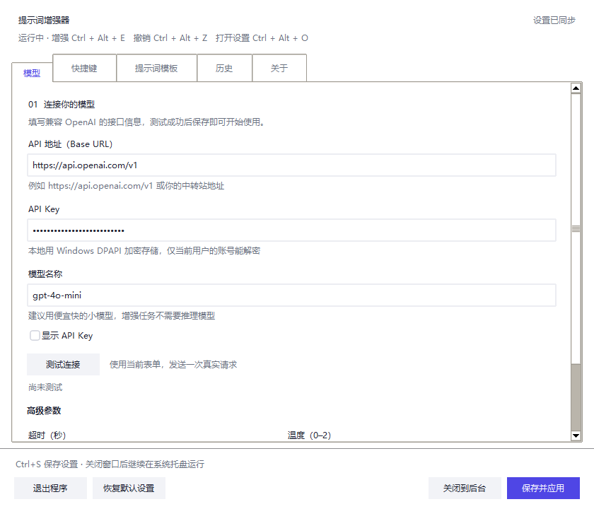

# 提示词增强器

本项目灵感来源于[WorkBuddy](https://www.workbuddy.cn/)中的提示词增强工具，通过将选中文本和系统提示词发送请求给LLM返回增强后的提示词并覆盖原文本的方式来运行。


把一段草稿整理成更明确、可执行的提示词。Windows 桌面版常驻托盘：在可编辑输入框选中文字，按快捷键增强，再粘贴回原位置。你可以修改提示词模板、查看历史并复制原文。

需要自备兼容 OpenAI Chat Completions 接口的 API 服务、API Key 和模型。增强请求可能产生服务商费用。

## 快速开始

1. 从本仓库 **Releases** 下载 `PromptEnhancer-1.1.0-win64.zip`，完整解压。
2. 运行 `PromptEnhancer.exe`。首次启动填写 API 地址、API Key 和模型名称，测试连接后保存并应用。
3. 在普通输入框选中一段测试文字，按 `Ctrl+Alt+E`。



| 默认快捷键 | 操作 |
|---|---|
| `Ctrl+Alt+E` | 增强选中的文字 |
| `Ctrl+Alt+Z` | 撤销上一次增强，或把原文复制到剪贴板 |
| `Ctrl+Alt+O` | 打开设置 |

关闭设置窗口后继续在托盘运行；使用托盘菜单或设置中的“退出程序”结束运行。快捷键可在设置中修改；被其他软件占用时需要换一组。

桌面发行包支持 **Windows 10 / 11 64 位**，不需要安装 Python。当前构建未提供代码签名，Windows 可能显示来源或信誉提示；可使用 Release 附件 `SHA256SUMS.txt` 校验下载文件。

## 操作边界与数据

- 增强依赖系统复制、粘贴和目标应用的输入行为，先在普通输入框测试兼容性。
- 等待结果时切换窗口或发生键鼠操作，会改为仅复制结果。若期间复制了新内容，会保留新剪贴板，增强结果可从历史复制。
- 未自动粘贴的结果不会注入原生撤销；已经继续编辑时，原生撤销可能撤回后续编辑，建议从历史复制原文。
- 默认只增强选中文本。启用“没有选区时使用剪贴板”后，可能处理此前复制的内容。
- 文本会发送到你配置的 API 地址。设置、历史和日志默认保存在 `%APPDATA%\PromptEnhancer\`；API Key 使用当前用户的 Windows DPAPI 保护，历史包含明文原文和结果。

升级前退出旧版本，再运行新版本，已有配置会保留。卸载时退出程序并删除解压目录；需要清除历史和配置时，再删除上述数据目录。

## 从源码运行

使用 Python 3.10+；Windows 桌面版需要 Tcl/Tk（可在 python.org 安装器中选择）。运行时使用标准库，无需安装第三方 Python 包。

```powershell
python desktop/main.py --show
```

CLI、代理和 MCP 使用 `config.env` 或环境变量配置，与桌面版的设置存储分开。使用前复制配置示例并填写自己的服务信息；不要提交真实配置。

```powershell
Copy-Item config.env.example config.env
python cli.py --strict "帮我把需求写清楚"
```

其他入口：`hotkey.py`（无界面快捷键）、`proxy.py`（本地代理）、`mcp_server.py`（MCP stdio）。请先查看对应脚本的参数和配置说明；这些入口不负责控制桌面设置窗口。

## 测试与构建

```powershell
python -m unittest discover -s tests -v
python tools/make_release.py --smoke-source
python -m pip install -r requirements-build.txt
python tools/make_release.py --build
```

桌面 smoke 和打包命令在 Windows 上运行；打包使用 64 位 Python。输出位于 `release/`，包含发行 ZIP、SHA256 校验和以及发布说明。脚本会校验构建输入、版本、压缩包内容，并执行隔离的启动和退出检查。

## 项目文档

- [桌面使用说明](desktop/README.md)
- [更新日志](CHANGELOG.md)
- [上传 GitHub 与发布 Release](docs/RELEASING.md)
- [v1.1.0 本地验证记录](docs/VALIDATION.md)
- [贡献指南](CONTRIBUTING.md)
- [安全与隐私说明](SECURITY.md)

MIT License，见 [LICENSE](LICENSE)。
